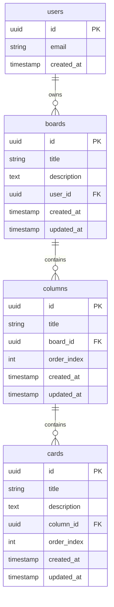

# 🗂️ Advanced Trello Clone - Complete Project Management Solution

<div align="center">
  
  
  
  
  
</div>

<p align="center">
  <strong>A modern, full-featured Trello clone with advanced drag-and-drop, real-time updates, and comprehensive project management tools</strong>
</p>

<p align="center">
  <a href="#-features"><strong>Features</strong></a> ·
  <a href="#-quick-start"><strong>Quick Start</strong></a> ·
  <a href="#-usage-guide"><strong>Usage Guide</strong></a> ·
  <a href="#-tech-stack"><strong>Tech Stack</strong></a> ·
  <a href="#-database-schema"><strong>Database</strong></a>
</p>

---

## ✨ Features

### 🚀 **Core Project Management**

- **📋 Multiple Boards** - Create unlimited project boards with custom names and descriptions
- **📂 Smart Columns** - Auto-generated "To Do", "In Progress", "Done" columns + custom columns
- **📝 Rich Cards** - Detailed task cards with titles, descriptions, and metadata
- **🖱️ Advanced Drag & Drop** - Intuitive drag-and-drop with visual feedback and collision detection
- **⚡ Real-time Persistence** - All changes save instantly to database with optimistic updates
- **🔄 Auto-Reordering** - Smart card positioning and automatic order management

### 🎯 **Board Management Features**

- **✏️ Board Editing** - Edit board names and descriptions inline with live preview
- **🗑️ Board Deletion** - Safe board deletion with confirmation dialogs and loading states
- **📊 Board Overview** - Dashboard view with board cards showing creation dates and descriptions
- **🚀 Board Creation** - Streamlined board creation with loading states and auto-navigation
- **🔍 Board Navigation** - Breadcrumb navigation and smart routing between boards

### 📝 **Card & Column Operations**

- **➕ Card Creation** - Add cards with titles and descriptions using modal dialogs
- **✏️ Card Editing** - Inline card editing with keyboard shortcuts (Ctrl+Enter to save, Esc to cancel)
- **🗑️ Card Deletion** - Safe card deletion with confirmation and optimistic UI updates
- **📋 Column Management** - Add, delete, and organize columns with drag-and-drop support
- **🔄 Smart Reordering** - Automatic position calculation and database synchronization

### 🖱️ **Enhanced Drag & Drop System**

- **🎯 Collision Detection** - Smart collision detection using closest corners algorithm
- **🔄 Cross-Column Movement** - Move cards between different columns with proper positioning
- **📍 Precise Positioning** - Drop cards at exact positions within columns
- **👻 Visual Feedback** - Semi-transparent dragging states and hover effects
- **⚡ Performance Optimized** - Optimistic updates with database sync for smooth UX

### 🔐 **Authentication & Security**

- **🔑 Secure Authentication** - Email/password auth with Supabase integration
- **📧 Email Verification** - Optional email verification system
- **🚪 Smart Login Flow** - Auto-redirect to dashboard after successful authentication
- **🔒 Session Management** - Persistent sessions with automatic token refresh
- **🛡️ Row Level Security** - Database-level security ensuring complete data isolation
- **🚨 Route Protection** - Middleware-based route protection with smart redirects
- **🚪 Enhanced Logout** - Visual logout with loading states and session cleanup

### 🎨 **User Experience & Interface**

- **🌙 Dark/Light Theme** - Beautiful theme switching with system preference detection
- **📱 Fully Responsive** - Perfect experience on desktop, tablet, and mobile devices
- **⚡ Loading States** - Comprehensive loading indicators for all async operations
- **🎭 Smooth Animations** - Professional drag-and-drop animations and transitions
- **🔔 Error Handling** - User-friendly error messages with actionable feedback
- **⌨️ Keyboard Shortcuts** - Productivity shortcuts for power users

### 🛠️ **Developer Experience**

- **🔧 Full TypeScript** - Complete type safety throughout the application
- **🧩 Component Architecture** - Modular, reusable components with clear interfaces
- **📊 Structured Database** - Well-designed PostgreSQL schema with proper relationships
- **🎯 Modern Stack** - Next.js 15 App Router with Server Components
- **🔍 Debug Tools** - Comprehensive logging and debugging infrastructure

---

## 🚀 Quick Start

### Prerequisites

- **Node.js 18+** installed on your system
- **Supabase Account** ([create free account](https://supabase.com))
- **Git** for cloning the repository

### 1. **Clone and Install Dependencies**

```bash
# Clone the repository
git clone <your-repo-url>
cd trello

# Install dependencies
npm install
# or
yarn install
# or
pnpm install
```

### 2. **Set up Supabase Database**

1. **Create Supabase Project**

   - Go to [supabase.com](https://supabase.com)
   - Click "New Project"
   - Choose organization and set project details

2. **Run Database Setup**

   - Open Supabase dashboard → SQL Editor
   - Copy content from `setup-database.sql`
   - Paste and click "Run" to create:
     - Tables: `boards`, `columns`, `cards`
     - Row Level Security policies
     - Proper relationships and indexes

3. **Enable Row Level Security**
   - Go to Authentication → Settings
   - Ensure RLS is enabled for all tables

### 3. **Environment Configuration**

Create `.env.local` in root directory:

```bash
# Supabase Configuration
NEXT_PUBLIC_SUPABASE_URL=your_supabase_project_url
NEXT_PUBLIC_SUPABASE_PUBLISHABLE_OR_ANON_KEY=your_supabase_anon_key
```

**💡 Where to find these values:**

- Supabase Dashboard → Settings → API
- Copy "Project URL" and "Project API keys" → "anon" → "public"

### 4. **Start Development Server**

```bash
npm run dev
```

🎉 **Your Trello clone is now running at [http://localhost:3000](http://localhost:3000)**

---

## 📖 Complete Usage Guide

### 🚀 **Getting Started**

#### 1. **Account Creation & Authentication**

**Sign Up Process:**

- Click "Sign up" on the login page
- Enter email and secure password
- Optional: Verify email (configurable in Supabase)
- Automatic redirect to dashboard after successful signup

**Login Process:**

- Use "Sign in" with existing credentials
- Persistent sessions across browser restarts
- Smart redirect to intended page after login
- Secure session management with automatic token refresh

**Account Management:**

- View profile information in navigation bar
- Enhanced logout with visual feedback and loading states
- Complete session cleanup on logout
- Automatic redirect to login page after logout

#### 2. **Dashboard Navigation**

**Main Features:**

- **Board Grid View**: All your boards displayed as responsive cards
- **Create Board Button**: Prominent call-to-action for new boards
- **Theme Toggle**: Switch between dark/light themes
- **User Menu**: Profile info and logout functionality

**Board Cards Display:**

- Board title and description
- Creation date with calendar icon
- Hover effects and interaction feedback
- Click to open board or use dropdown for actions

### 📋 **Board Management**

#### **Creating Boards**

1. **From Dashboard:**

   - Click "Create Board" button
   - Fill in board title (required)
   - Add optional description
   - Loading state during creation
   - Auto-navigation to new board

2. **From Empty State:**
   - First-time users see "Create your first board"
   - Same creation flow with helpful messaging

**Board Creation Features:**

- Real-time form validation
- Loading states and progress indicators
- Error handling with user-friendly messages
- Immediate board access after creation

#### **Board Operations**

**Viewing Boards:**

- Clean card layout with hover effects
- Board information including creation date
- Quick access to board actions
- Responsive grid adapts to screen size

**Editing Board Details:**

- **Title Editing**: Click edit icon next to board title
- **Description Editing**: Click edit icon in description area
- **Inline Editing**: Edit directly in place with input fields
- **Keyboard Shortcuts**:
  - `Ctrl+Enter` to save changes
  - `Esc` to cancel editing
- **Visual Feedback**: Save/cancel buttons with icons
- **Real-time Updates**: Changes reflect immediately

**Deleting Boards:**

- Confirmation dialog with board name
- Warning about permanent deletion
- Loading state during deletion process
- Automatic cleanup of related columns and cards

### 📂 **Column Management**

#### **Default Columns**

Every new board automatically includes:

- **📝 To Do** - For planned tasks
- **⚡ In Progress** - For active work
- **✅ Done** - For completed tasks

#### **Custom Columns**

- **Add Columns**: Click "Add another list" button
- **Name Columns**: Custom titles for specific workflows
- **Delete Columns**: Use column dropdown menu
- **Reorder**: Drag columns to reorganize (if implemented)

#### **Column Features**

- **Card Counter**: Shows number of cards in each column
- **Add Card Button**: Quick card creation within columns
- **Column Actions**: Dropdown menu for column management
- **Visual Design**: Clean, modern column layout

### 📝 **Card Management System**

#### **Creating Cards**

**Basic Card Creation:**

1. Click "Add a card" in any column
2. Enter card title (required)
3. Add optional description
4. Auto-save and immediate display

**Advanced Card Features:**

- **Rich Descriptions**: Multi-line text support
- **Auto-positioning**: New cards appear at bottom of column
- **Instant Feedback**: Cards appear immediately after creation

#### **Card Editing & Management**

**Inline Editing:**

- **Edit Mode**: Click edit icon on card
- **Title & Description**: Edit both fields simultaneously
- **Keyboard Shortcuts**:
  - `Ctrl+Enter` to save changes
  - `Esc` to cancel editing
- **Visual States**: Clear edit/view mode distinction

**Card Actions:**

- **Edit**: Inline editing with rich text support
- **Delete**: Safe deletion with confirmation
- **Move**: Drag and drop between columns
- **Reorder**: Change position within columns

#### **Card Information Display**

- **Title**: Prominent display with proper typography
- **Description**: Formatted text with line breaks
- **Actions Menu**: Accessible dropdown for operations
- **Visual Hierarchy**: Clear information structure

### 🖱️ **Advanced Drag & Drop System**

#### **Drag and Drop Capabilities**

**Cross-Column Movement:**

- Drag cards between any columns
- Visual feedback during drag operation
- Smart drop zone detection
- Automatic position calculation

**Within-Column Reordering:**

- Drag cards up/down within same column
- Precise positioning between existing cards
- Visual placeholders show drop location
- Immediate order updates

**Drag States:**

- **Dragging**: Semi-transparent card appearance
- **Valid Drop Zone**: Visual highlighting
- **Invalid Drop**: Clear visual feedback
- **Drop Success**: Smooth transition animation

#### **Technical Features**

- **Collision Detection**: Uses closest corners algorithm
- **Performance**: Optimized for smooth 60fps dragging
- **Accessibility**: Keyboard navigation support
- **Mobile**: Touch-friendly drag operations

#### **Database Synchronization**

- **Optimistic Updates**: UI updates immediately
- **Background Sync**: Database updates happen seamlessly
- **Error Recovery**: Automatic rollback on sync failures
- **Order Management**: Smart order_index calculation

### 🎨 **User Interface Features**

#### **Theme System**

- **Dark Mode**: Professional dark theme for low-light work
- **Light Mode**: Clean, bright theme for all-day use
- **System Sync**: Automatic detection of system preference
- **Instant Toggle**: Immediate theme switching
- **Persistent Choice**: Theme preference saved across sessions

#### **Responsive Design**

- **Desktop**: Full-featured experience with hover states
- **Tablet**: Touch-optimized interface with proper spacing
- **Mobile**: Streamlined UI with essential features
- **Adaptive Layout**: Columns and cards adjust to screen size

#### **Loading States & Feedback**

- **Board Creation**: Full-screen overlay with progress message
- **Board Deletion**: Loading overlay with deletion progress
- **Card Operations**: Button-level loading indicators
- **Drag Operations**: Visual feedback during movement
- **Form Submission**: Disabled states and loading spinners

### ⌨️ **Keyboard Shortcuts**

| Action         | Shortcut       | Context                 |
| -------------- | -------------- | ----------------------- |
| Save Changes   | `Ctrl + Enter` | Card/Board editing      |
| Cancel Editing | `Esc`          | Any edit mode           |
| Create Card    | `Enter`        | In card creation dialog |
| Close Dialog   | `Esc`          | Any modal dialog        |

### 🔐 **Security & Privacy**

#### **Data Protection**

- **User Isolation**: Complete separation of user data
- **Row Level Security**: Database-level access control
- **Secure Sessions**: Encrypted session management
- **API Security**: Protected endpoints with authentication

#### **Privacy Features**

- **Private Boards**: Only you can see your boards
- **Secure Storage**: All data encrypted in transit and at rest
- **No Data Sharing**: Your project data stays private
- **GDPR Compliant**: Built with privacy by design

---

## 🛠️ Tech Stack

### **Frontend Architecture**

| Technology          | Version | Purpose                               |
| ------------------- | ------- | ------------------------------------- |
| **⚡ Next.js**      | 15.5.2  | React framework with App Router       |
| **🔷 TypeScript**   | Latest  | Static type checking and IntelliSense |
| **🎨 Tailwind CSS** | Latest  | Utility-first CSS framework           |
| **🧩 Radix UI**     | Latest  | Headless, accessible UI components    |
| **🎭 @dnd-kit**     | Latest  | Modern drag and drop library          |
| **🌙 next-themes**  | Latest  | Theme switching with system detection |

### **Backend & Database**

| Service                   | Purpose                            |
| ------------------------- | ---------------------------------- |
| **🗄️ Supabase**           | Backend as a Service platform      |
| **🐘 PostgreSQL**         | Robust relational database         |
| **🔐 Supabase Auth**      | User authentication and management |
| **🛡️ Row Level Security** | Database-level security policies   |
| **⚡ Real-time**          | Live data synchronization          |

### **Development Tools**

| Tool              | Purpose                      |
| ----------------- | ---------------------------- |
| **📝 ESLint**     | Code linting and quality     |
| **🎯 TypeScript** | Type checking and validation |
| **⚡ Turbopack**  | Fast development bundler     |
| **🔧 shadcn/ui**  | Beautiful component library  |

---

## 📊 Database Schema

### **Table Structure**

```sql
-- Boards table
boards
├── id (UUID, Primary Key)
├── title (VARCHAR, Not Null)
├── description (TEXT, Nullable)
├── user_id (UUID, Foreign Key → auth.users)
├── created_at (TIMESTAMP, Default: now())
└── updated_at (TIMESTAMP, Default: now())

-- Columns table
columns
├── id (UUID, Primary Key)
├── title (VARCHAR, Not Null)
├── board_id (UUID, Foreign Key → boards.id)
├── order_index (INTEGER, Not Null)
├── created_at (TIMESTAMP, Default: now())
└── updated_at (TIMESTAMP, Default: now())

-- Cards table
cards
├── id (UUID, Primary Key)
├── title (VARCHAR, Not Null)
├── description (TEXT, Nullable)
├── column_id (UUID, Foreign Key → columns.id)
├── order_index (INTEGER, Not Null)
├── created_at (TIMESTAMP, Default: now())
└── updated_at (TIMESTAMP, Default: now())
```

### **Relationships**



### **Security Policies**

```sql
-- Users can only see their own boards
CREATE POLICY "Users can view own boards" ON boards
    FOR SELECT USING (auth.uid() = user_id);

-- Users can only modify their own boards
CREATE POLICY "Users can modify own boards" ON boards
    FOR ALL USING (auth.uid() = user_id);

-- Cascade policies for columns and cards
-- (Similar RLS policies for columns and cards tables)
```

---

## 🎯 Project Architecture

### **Directory Structure**

```
trello/
├── 📁 app/                          # Next.js App Router
│   ├── 📁 board/[id]/              # Dynamic board routes
│   │   └── page.tsx                # Individual board view
│   ├── 📁 auth/                    # Authentication pages
│   │   ├── 📁 login/               # Login page
│   │   ├── 📁 sign-up/             # Registration page
│   │   └── 📁 confirm/             # Email confirmation
│   ├── page.tsx                    # Main dashboard
│   ├── layout.tsx                  # Root layout
│   └── globals.css                 # Global styles
├── 📁 components/                   # React components
│   ├── 📁 ui/                      # Base UI components
│   │   ├── button.tsx              # Button component
│   │   ├── card.tsx                # Card component
│   │   ├── input.tsx               # Input component
│   │   └── dropdown-menu.tsx       # Dropdown component
│   ├── board-view.tsx              # Individual board view
│   ├── boards-list.tsx             # Dashboard with all boards
│   ├── card-item.tsx               # Individual card component
│   ├── column.tsx                  # Column component
│   ├── add-board-dialog.tsx        # Board creation modal
│   ├── add-card-dialog.tsx         # Card creation modal
│   └── theme-switcher.tsx          # Theme toggle component
├── 📁 lib/                         # Utilities and configurations
│   ├── 📁 supabase/               # Supabase client setup
│   │   ├── client.ts              # Client-side Supabase
│   │   ├── server.ts              # Server-side Supabase
│   │   └── middleware.ts          # Middleware configuration
│   ├── types.ts                   # TypeScript type definitions
│   └── utils.ts                   # Helper functions
├── 📁 hooks/                       # Custom React hooks
├── middleware.ts                   # Next.js middleware
├── setup-database.sql              # Database setup script
├── TRELLO_SETUP.md                # Detailed setup guide
└── README.md                      # This file
```

### **Component Architecture**

```
BoardView (Main Container)
├── Navigation Bar
│   ├── Back Button
│   ├── Board Title (Editable)
│   └── Delete Board Button
├── Board Description (Editable)
├── Columns Container (DndContext)
│   ├── Column Component
│   │   ├── Column Header
│   │   ├── Cards Container (SortableContext)
│   │   │   └── CardItem Component
│   │   │       ├── Card Content
│   │   │       └── Card Actions Menu
│   │   └── Add Card Button
│   └── Add Column Button
├── Add Column Dialog
└── Add Card Dialog
```

---

## 🚀 Deployment Guide

### **Vercel Deployment (Recommended)**

1. **Connect Repository**

   ```bash
   # Push to GitHub
   git add .
   git commit -m "Initial commit"
   git push origin main
   ```

2. **Deploy to Vercel**

   - Go to [vercel.com](https://vercel.com)
   - Import your GitHub repository
   - Add environment variables:
     - `NEXT_PUBLIC_SUPABASE_URL`
     - `NEXT_PUBLIC_SUPABASE_ANON_KEY`
   - Deploy automatically

3. **Configure Supabase**
   - Add your Vercel domain to Supabase Auth settings
   - Update site URL and redirect URLs

### **Manual Deployment**

```bash
# Build the application
npm run build

# Start production server
npm start
```

---

## 🐛 Troubleshooting

### **Common Issues & Solutions**

#### **Authentication Problems**

**Issue**: Users can't log in

```bash
# Check environment variables
echo $NEXT_PUBLIC_SUPABASE_URL
echo $NEXT_PUBLIC_SUPABASE_ANON_KEY

# Verify Supabase configuration
# Dashboard → Settings → API
```

**Issue**: Redirect loops after login

- Check middleware.ts configuration
- Verify protected routes setup
- Ensure proper session handling

#### **Database Issues**

**Issue**: Can't create boards/cards

- Verify RLS policies are enabled
- Check user authentication state
- Ensure proper database schema

**Issue**: Drag and drop not working

- Check @dnd-kit installation
- Verify collision detection setup
- Ensure proper state management

#### **Performance Issues**

**Issue**: Slow drag operations

- Check for unnecessary re-renders
- Optimize state updates
- Verify database query efficiency

### **Debug Tools**

```javascript
// Enable debug mode in development
if (process.env.NODE_ENV === "development") {
  console.log("Debug mode enabled");
  // Add debug statements
}
```

---

## 🤝 Contributing

### **Development Setup**

1. **Fork and Clone**

   ```bash
   git clone https://github.com/your-username/trello.git
   cd trello
   npm install
   ```

2. **Create Feature Branch**

   ```bash
   git checkout -b feature/amazing-feature
   ```

3. **Make Changes**

   - Follow TypeScript strict mode
   - Add appropriate types
   - Write clean, documented code
   - Test thoroughly

4. **Submit Pull Request**
   ```bash
   git add .
   git commit -m "Add amazing feature"
   git push origin feature/amazing-feature
   ```

### **Contribution Guidelines**

- **Code Style**: Follow existing patterns and TypeScript conventions
- **Components**: Create reusable, well-documented components
- **Testing**: Test all new features thoroughly
- **Documentation**: Update README for significant changes
- **Security**: Follow security best practices

---

## 📝 License

This project is open source and available under the **MIT License**.

```
MIT License

Copyright (c) 2025 Trello Clone Project

Permission is hereby granted, free of charge, to any person obtaining a copy
of this software and associated documentation files (the "Software"), to deal
in the Software without restriction, including without limitation the rights
to use, copy, modify, merge, publish, distribute, sublicense, and/or sell
copies of the Software, and to permit persons to whom the Software is
furnished to do so, subject to the following conditions:

The above copyright notice and this permission notice shall be included in all
copies or substantial portions of the Software.
```

---

## 🙏 Acknowledgments

### **Core Technologies**

- **Next.js Team** - For the incredible React framework and App Router
- **Supabase Team** - For the excellent backend-as-a-service platform
- **Vercel** - For seamless deployment and hosting solutions

### **UI & Design**

- **Radix UI** - For accessible, unstyled UI primitives
- **Tailwind CSS** - For the utility-first CSS framework
- **shadcn/ui** - For beautiful, copy-paste components
- **Lucide** - For the comprehensive icon library

### **Functionality**

- **@dnd-kit** - For the modern, accessible drag and drop library
- **next-themes** - For elegant theme switching functionality

### **Development Experience**

- **TypeScript Team** - For bringing type safety to JavaScript
- **ESLint Team** - For code quality and consistency tools

---

<div align="center">
  
## 🚀 Ready to Build Something Amazing?

**This Trello clone provides a solid foundation for building sophisticated project management tools. Whether you're learning modern web development or building a production application, this codebase demonstrates industry best practices and cutting-edge technologies.**

### **What You Get:**

✅ **Production-Ready Code** - Clean, scalable, well-documented  
✅ **Modern Tech Stack** - Next.js 15, TypeScript, Supabase  
✅ **Advanced Features** - Drag & drop, real-time updates, authentication  
✅ **Developer Experience** - Full type safety, component architecture  
✅ **Deployment Ready** - Vercel integration, environment setup

### **Perfect For:**

🎓 **Learning Projects** - Understand modern React patterns  
🏢 **Startups** - Quick MVP development  
🔧 **Portfolio Projects** - Showcase full-stack skills  
📚 **Educational Use** - Teaching modern web development

---

<p align="center">
  <strong>Built with ❤️ using Next.js, Supabase, and TypeScript</strong>
</p>

<p align="center">
  <a href="#-quick-start">Get Started</a> ·
  <a href="#-usage-guide">Learn More</a> ·
  <a href="#-contributing">Contribute</a>
</p>

**⭐ If this project helped you, please consider giving it a star!**

</div>

---

## ✨ Features

### 🚀 **Core Functionality**

- **📋 Multiple Boards** - Create unlimited project boards
- **📂 Auto Columns** - Every board gets "To Do", "In Progress", "Done" columns automatically
- **🎯 Custom Columns** - Add your own columns to organize work your way
- **📝 Smart Cards** - Create detailed task cards with titles and descriptions
- **🖱️ Drag & Drop** - Intuitive drag-and-drop interface for moving cards between columns
- **⚡ Real-time Updates** - All changes sync instantly to the database

### 🔐 **Authentication & Security**

- **🔑 User Authentication** - Secure sign-up and login system with email verification
- **🚪 Smart Login Flow** - After login, users are redirected to the main dashboard
- **� Easy Logout** - One-click logout with visual feedback and automatic redirect
- **�🛡️ Row Level Security** - Users can only access their own boards and data
- **� Protected Routes** - Automatic redirection to login for unauthenticated users
- **🍪 Session Management** - Persistent login sessions across browser restarts
- **🔒 Middleware Protection** - Server-side route protection for enhanced security

### 🎨 **User Experience**

- **🌙 Dark/Light Theme** - Toggle between beautiful dark and light themes
- **📱 Responsive Design** - Works perfectly on desktop, tablet, and mobile
- **⚡ Fast Loading** - Optimized performance with Next.js 15
- **🎭 Smooth Animations** - Professional drag-and-drop animations
- **💾 Auto Save** - Everything saves automatically, no manual save needed

### 🛠️ **Developer Features**

- **🔧 TypeScript** - Full type safety throughout the application
- **🎨 Tailwind CSS** - Modern, utility-first CSS framework
- **🧩 Component Library** - Built with Radix UI and shadcn/ui components
- **🏗️ Modern Architecture** - Next.js App Router with Server Components
- **📊 Database Design** - Well-structured PostgreSQL schema with relationships

---

## 🚀 Quick Start

### Prerequisites

- Node.js 18+ installed
- A Supabase account ([create one here](https://supabase.com))

### 1. **Clone and Install**

```bash
git clone <your-repo-url>
cd trello
npm install
```

### 2. **Set up Supabase Database**

1. Create a new project at [supabase.com](https://supabase.com)
2. Go to SQL Editor in your Supabase dashboard
3. Copy and paste the content from `setup-database.sql`
4. Click "Run" to create all tables and security policies

### 3. **Environment Configuration**

Create a `.env.local` file in the root directory:

```bash
NEXT_PUBLIC_SUPABASE_URL=your_supabase_project_url
NEXT_PUBLIC_SUPABASE_PUBLISHABLE_OR_ANON_KEY=your_supabase_anon_key
```

> 💡 Find these values in your Supabase dashboard under Settings → API

### 4. **Run the Application**

```bash
npm run dev
```

Visit [http://localhost:3000](http://localhost:3000) to see your Trello clone! 🎉

---

## 📖 Usage Guide

### **Getting Started**

#### 1. **Create an Account & Login**

- **Sign Up**: Click "Sign up" to create your account with email and password
- **Email Verification**: Check your email for verification (optional, depending on Supabase settings)
- **Sign In**: Use "Sign in" if you already have an account
- **Smart Redirect**: After successful login, you'll be automatically redirected to the main dashboard
- **Session Persistence**: Your login session will persist across browser restarts

#### 2. **Account Management**

- **View Profile**: Your email is displayed in the top navigation
- **Sign Out**: Click the "Sign out" button (with logout icon) to securely log out
- **Auto Logout**: You'll be automatically redirected to login page after logout
- **Protected Access**: Trying to access boards without login will redirect you to sign-in page

#### 3. **Create Your First Board**

- Click "Create Board" on the main dashboard
- Give your board a name and optional description
- Your board will automatically get three columns: "To Do", "In Progress", "Done"

### **Managing Boards**

#### **📋 Board Operations**

- **Create Board**: Click "Create Board" button on the dashboard
- **View Boards**: All your boards are displayed as cards on the main page
- **Open Board**: Click any board card to enter the board view
- **Board Info**: Each board shows its name, description, and creation date

### **Working with Columns**

#### **📂 Column Management**

- **Default Columns**: Every new board starts with three columns
- **Add Column**: Click "Add another list" to create custom columns
- **Delete Column**: Use the "..." menu on any column header
- **Organize**: Columns help categorize your tasks by status or priority

### **Managing Cards**

#### **📝 Card Operations**

- **Add Card**: Click "Add a card" in any column
- **Edit Details**: Cards support titles and descriptions
- **Move Cards**: Drag and drop cards between columns
- **Delete Card**: Use the "..." menu on any card
- **Reorder**: Drag cards up/down within the same column

#### **🖱️ Drag & Drop Features**

- **Between Columns**: Drag cards to move them between different columns
- **Within Column**: Reorder cards by dragging them up or down
- **Visual Feedback**: Cards become semi-transparent while dragging
- **Auto Save**: All position changes save automatically

### **Navigation & Authentication**

#### **🧭 Moving Around**

- **Dashboard**: Click "Trello Clone" logo to return to board list
- **Back to Boards**: Use "Back to Boards" button in any board view
- **Theme Toggle**: Switch between dark and light themes anytime

#### **🔐 Account Management**

- **User Profile**: Your email is displayed in the top navigation when logged in
- **Enhanced Logout**: Click "Sign out" button with the following features:
  - Visual logout icon for better UX
  - Loading state with "Signing out..." text
  - Automatic redirect to login page
  - Session cleanup and auth state refresh
- **Auto Protection**: Accessing protected routes without login redirects to sign-in

---

## 🛠️ Tech Stack

### **Frontend**

- **⚡ Next.js 15** - React framework with App Router
- **🔷 TypeScript** - Static type checking
- **🎨 Tailwind CSS** - Utility-first CSS framework
- **🧩 Radix UI** - Headless UI components
- **🎭 @dnd-kit** - Modern drag and drop library
- **🌙 next-themes** - Theme switching support

### **Backend & Database**

- **🗄️ Supabase** - Backend as a Service
- **🐘 PostgreSQL** - Robust relational database
- **🔐 Row Level Security** - Database-level security
- **🔑 Supabase Auth** - Authentication and user management

### **Development Tools**

- **📝 ESLint** - Code linting
- **🎯 TypeScript** - Type checking
- **⚡ Turbopack** - Fast bundler for development

---

## 📊 Database Schema

### **Tables Structure**

```sql
boards
├── id (UUID)
├── title (VARCHAR)
├── description (TEXT)
├── user_id (UUID) → auth.users
├── created_at (TIMESTAMP)
└── updated_at (TIMESTAMP)

columns
├── id (UUID)
├── title (VARCHAR)
├── board_id (UUID) → boards
├── order_index (INTEGER)
├── created_at (TIMESTAMP)
└── updated_at (TIMESTAMP)

cards
├── id (UUID)
├── title (VARCHAR)
├── description (TEXT)
├── column_id (UUID) → columns
├── order_index (INTEGER)
├── created_at (TIMESTAMP)
└── updated_at (TIMESTAMP)
```

### **Security Policies**

- ✅ Users can only access their own boards
- ✅ Users can only modify their own data
- ✅ Automatic user isolation
- ✅ Secure API endpoints

---

## 🎯 Project Structure

```
trello/
├── app/                          # Next.js App Router
│   ├── board/[id]/              # Dynamic board routes
│   ├── auth/                    # Authentication pages
│   └── page.tsx                 # Main dashboard
├── components/                   # React components
│   ├── ui/                      # Base UI components
│   ├── board-view.tsx           # Individual board view
│   ├── boards-list.tsx          # Dashboard with all boards
│   └── ...                      # Other components
├── lib/                         # Utilities and configs
│   ├── supabase/               # Supabase client setup
│   ├── types.ts                # TypeScript definitions
│   └── utils.ts                # Helper functions
├── hooks/                       # Custom React hooks
├── setup-database.sql           # Database setup script
└── TRELLO_SETUP.md             # Detailed setup guide
```

---

## 🔐 Authentication & Security Features

### **🚪 Login Flow**

1. **Registration**: Create account with email/password
2. **Email Verification**: Optional email confirmation (configurable in Supabase)
3. **Secure Login**: Password-based authentication with session management
4. **Smart Redirect**: Automatic redirect to dashboard after successful login
5. **Session Persistence**: Stay logged in across browser sessions

### **🛡️ Security Measures**

- **Row Level Security (RLS)**: Database-level security ensuring users only see their data
- **Protected Routes**: Middleware automatically redirects unauthenticated users
- **Secure Sessions**: Cookie-based session management with automatic renewal
- **Data Isolation**: Complete separation of user data at the database level

### **🔓 Logout & Session Management**

- **Enhanced Logout Button**: Visual feedback with loading states
- **Complete Session Cleanup**: Proper session termination and cache clearing
- **Automatic Redirect**: Seamless redirect to login page after logout
- **Security Best Practices**: Secure token handling and session invalidation

---

## 🎨 Features in Action

### **Authentication Flow**

- Secure sign-up and login process with immediate feedback
- Clean error handling and user-friendly messages
- Persistent sessions with automatic token refresh
- Protected routes with intelligent redirection

### **Dashboard View**

- Clean, modern interface showing all your boards
- Create new boards with a single click
- Visual board cards with descriptions and dates
- Responsive grid layout

### **Board Interface**

- Kanban-style column layout
- Smooth drag-and-drop interactions
- Add/remove columns and cards easily
- Real-time updates across sessions

### **Authentication Flow**

- Secure sign-up and login process
- Persistent sessions
- Protected routes and data
- Clean error handling

---

## 🤝 Contributing

1. Fork the repository
2. Create your feature branch (`git checkout -b feature/amazing-feature`)
3. Commit your changes (`git commit -m 'Add some amazing feature'`)
4. Push to the branch (`git push origin feature/amazing-feature`)
5. Open a Pull Request

---

## 📝 License

This project is open source and available under the [MIT License](LICENSE).

---

## 🙏 Acknowledgments

- **Next.js Team** - For the amazing React framework
- **Supabase Team** - For the excellent backend-as-a-service platform
- **Radix UI** - For accessible, unstyled UI components
- **Tailwind CSS** - For the utility-first CSS framework
- **@dnd-kit** - For the modern drag and drop library

---

<div align="center">
  <p>Built with ❤️ using Next.js and Supabase</p>
  <p>🚀 <strong>Start building your own project management solution today!</strong></p>
</div>

## Features

- Works across the entire [Next.js](https://nextjs.org) stack
  - App Router
  - Pages Router
  - Middleware
  - Client
  - Server
  - It just works!
- supabase-ssr. A package to configure Supabase Auth to use cookies
- Password-based authentication block installed via the [Supabase UI Library](https://supabase.com/ui/docs/nextjs/password-based-auth)
- Styling with [Tailwind CSS](https://tailwindcss.com)
- Components with [shadcn/ui](https://ui.shadcn.com/)
- Optional deployment with [Supabase Vercel Integration and Vercel deploy](#deploy-your-own)
  - Environment variables automatically assigned to Vercel project

## Demo

You can view a fully working demo at [demo-nextjs-with-supabase.vercel.app](https://demo-nextjs-with-supabase.vercel.app/).

## Deploy to Vercel

Vercel deployment will guide you through creating a Supabase account and project.

After installation of the Supabase integration, all relevant environment variables will be assigned to the project so the deployment is fully functioning.

[](https://vercel.com/new/clone?repository-url=https%3A%2F%2Fgithub.com%2Fvercel%2Fnext.js%2Ftree%2Fcanary%2Fexamples%2Fwith-supabase&project-name=nextjs-with-supabase&repository-name=nextjs-with-supabase&demo-title=nextjs-with-supabase&demo-description=This+starter+configures+Supabase+Auth+to+use+cookies%2C+making+the+user%27s+session+available+throughout+the+entire+Next.js+app+-+Client+Components%2C+Server+Components%2C+Route+Handlers%2C+Server+Actions+and+Middleware.&demo-url=https%3A%2F%2Fdemo-nextjs-with-supabase.vercel.app%2F&external-id=https%3A%2F%2Fgithub.com%2Fvercel%2Fnext.js%2Ftree%2Fcanary%2Fexamples%2Fwith-supabase&demo-image=https%3A%2F%2Fdemo-nextjs-with-supabase.vercel.app%2Fopengraph-image.png)

The above will also clone the Starter kit to your GitHub, you can clone that locally and develop locally.

If you wish to just develop locally and not deploy to Vercel, [follow the steps below](#clone-and-run-locally).

## Clone and run locally

1. You'll first need a Supabase project which can be made [via the Supabase dashboard](https://database.new)

2. Create a Next.js app using the Supabase Starter template npx command

   ```bash
   npx create-next-app --example with-supabase with-supabase-app
   ```

   ```bash
   yarn create next-app --example with-supabase with-supabase-app
   ```

   ```bash
   pnpm create next-app --example with-supabase with-supabase-app
   ```

3. Use `cd` to change into the app's directory

   ```bash
   cd with-supabase-app
   ```

4. Rename `.env.example` to `.env.local` and update the following:

   ```
   NEXT_PUBLIC_SUPABASE_URL=[INSERT SUPABASE PROJECT URL]
   NEXT_PUBLIC_SUPABASE_ANON_KEY=[INSERT SUPABASE PROJECT API ANON KEY]
   ```

   Both `NEXT_PUBLIC_SUPABASE_URL` and `NEXT_PUBLIC_SUPABASE_ANON_KEY` can be found in [your Supabase project's API settings](https://supabase.com/dashboard/project/_?showConnect=true)

5. You can now run the Next.js local development server:

   ```bash
   npm run dev
   ```

   The starter kit should now be running on [localhost:3000](http://localhost:3000/).

6. This template comes with the default shadcn/ui style initialized. If you instead want other ui.shadcn styles, delete `components.json` and [re-install shadcn/ui](https://ui.shadcn.com/docs/installation/next)

> Check out [the docs for Local Development](https://supabase.com/docs/guides/getting-started/local-development) to also run Supabase locally.

## Feedback and issues

Please file feedback and issues over on the [Supabase GitHub org](https://github.com/supabase/supabase/issues/new/choose).

## More Supabase examples

- [Next.js Subscription Payments Starter](https://github.com/vercel/nextjs-subscription-payments)
- [Cookie-based Auth and the Next.js 13 App Router (free course)](https://youtube.com/playlist?list=PL5S4mPUpp4OtMhpnp93EFSo42iQ40XjbF)
- [Supabase Auth and the Next.js App Router](https://github.com/supabase/supabase/tree/master/examples/auth/nextjs)
